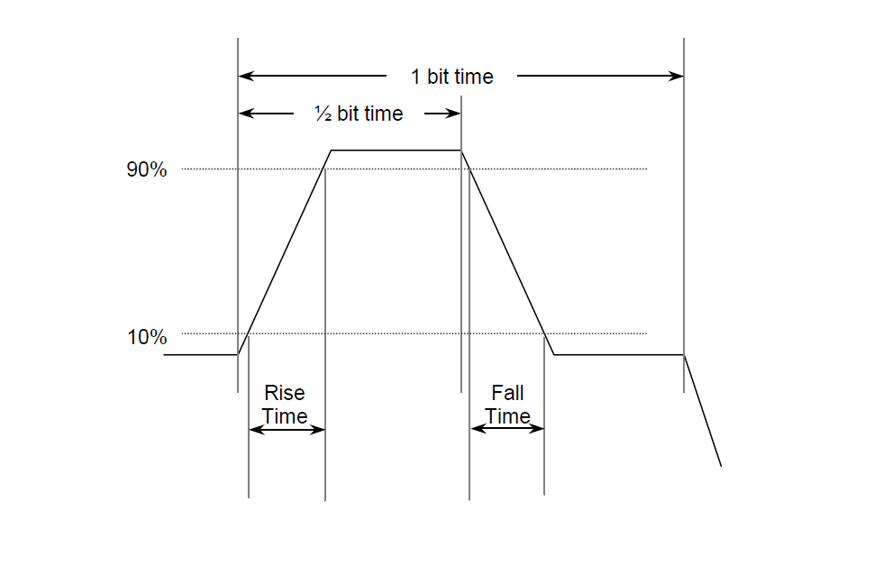

# Saleae-ARINC-429-Analyzer

An ARINC-429 Low-Level Analyzer for Saleae Logic Analyzer.

1. View label, SDI, Data, SSM and Parity fields of each ARINC word.
2. Works for all standard ARINC data rates i.e. 12.5, 50, 100 KHz/Kbps.
3. Displays results in number of different formats Hex, Binary, ASCII, Decimal and AsciiHex.
4. Updates tabular form for easy search.
5. Sample Data Generator that works with user settings i.e. Sample Rate.

TODO item's 4 and 7 requires significant re-work as to how data is being sampled and 5 personally think is low priority. 
So plans to implement the same in near future, PR's are welcome :^).

# Data Generation

Included is ability to generate sample data based on sampling rate and ARINC data rate.

This plugin assumes a trigger to digital at 1.2V, that is near instantenous logical HIGH at rise time and a very slow logical LOW at fall time. 
Extending the HIGH side of the wave past the 1/2 bit time, hence considering a 55/45 duty cycle wave. 

# TODO 

- [x] Test different ARINC data rates.
- [x] Validate different ARINC messages, edge cases.
- [x] Implement Sample Data Generator.
- [ ] Implement Data Exporter i.e. CSV. 
- [ ] Implement Parity validation and update Tabular Data and indicate same on bubble.
- [x] Display Data in Hex, Binary, ASCII, Decimal and AsciiHex ~~and Octal~~ (not supported) and option to choose between the two formats.
- [ ] Test at different trigger levels i.e. 1.2, 1.8 and 3.3V.

