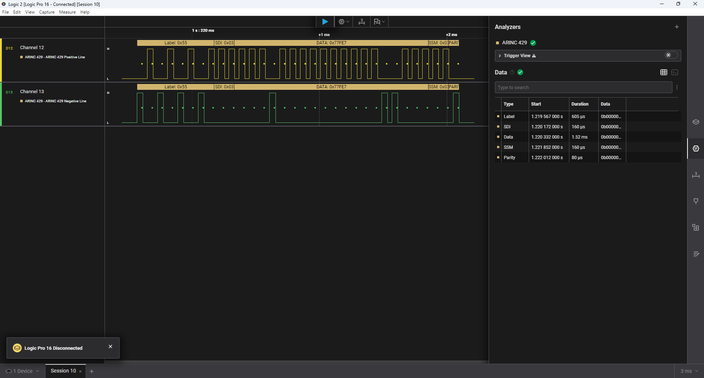
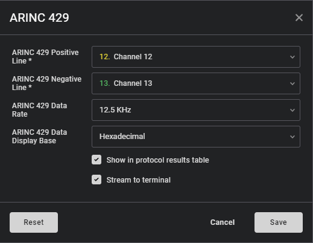

# Saleae-ARINC-429-Analyzer

An ARINC-429 Low-Level Analyzer for Saleae Logic Analyzer.

1. View label, SDI, Data, SSM and Parity fields of each ARINC word.
2. Works for all standard ARINC data rates i.e. 12.5, 50, 100 KHz/Kbps.
3. Displays results in number of different formats Hex, Binary, ASCII, Decimal and AsciiHex.
4. Updates tabular form for easy search.

# TODO 

- [x] Test different ARINC data rates.
- [x] Validate different ARINC messages, edge cases.
- [ ] Implement Sample Data Generator.
- [ ] Implement Data Exporter i.e. CSV.
- [ ] Implement Parity validation and update Tabular Data and indicate same on bubble.
- [x] Display Data in Hex, Binary, ASCII, Decimal and AsciiHex ~~and Octal~~ (not supported) and option to choose between the two formats.
